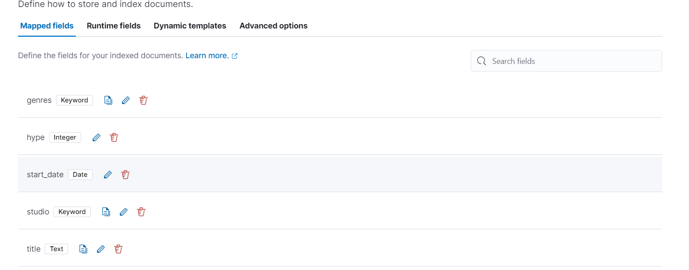

## Anime Search App
This is a simple Flask web application for searching and displaying anime information using Elastic App Search. The application allows users to search for anime titles and provides details such as studio, genres, hype, description, title link, and start date.

## Getting Started
Follow the instructions below to set up and run the Anime Search App.

## Prerequisites
* Python 3.x
* Flask
* Elastic App Search
* Swagger
* Flasgger

## Installation
1. Clone the repository to your local machine:

* git clone https://github.com/your-username/anime-search-app.git
* cd anime-search-app

2. Install the required Python packages:

* pip install -r requirements.txt

## Configuration
1. Create an account on Elastic Cloud if you don't have one.

2. Create an App Search engine on Elastic Cloud and note down the base endpoint, API key, and engine name.

3. Create a config.json file in the root directory with the following structure:

json

{
    "appsearch": {
        "base_endpoint": "your-appsearch-base-endpoint",
        "api_key": "your-appsearch-api-key",
        "engine_name": "your-appsearch-engine-name"
    }
}code 

## Running the App
1. Open a terminal in the project directory.

2. Run the following command to start the Flask app:

* python main.py
3. Open your web browser and go to http://localhost:5000 to access the Anime Search App.

## Usage
* The home page displays a list of anime titles.
* Use the search bar to enter a query and click the "Search" button to find specific anime titles.
* The results will be displayed with details such as genres, description, and a link to the MyAnimeList page.

## Indexing Data
* To index additional anime data, you can use the /index endpoint. Update the data.json file with the desired anime information and run the following command:

* curl -X GET http://localhost:5000/index
* This will index the data into your App Search engine.

## API Documentation
* Swagger documentation is available at http://localhost:5000/apidocs/ to explore the available endpoints and parameters.

# Anime API

| HTTP Method | Route | Description |
|-------------|-------|-------------|
| GET         | `/api/anime` | Get all anime (for admin or future expansion) |
| POST        | `/api/anime` | Create a new anime |
| GET         | `/api/anime/{anime_id}` | Get a specific anime by ID, and its associated data |
| PUT         | `/api/anime/{anime_id}` | Update anime details |
| DELETE      | `/api/anime/{anime_id}` | Delete an anime |

## Acknowledgments
* This project uses Flask for the web framework, Elastic App Search for search functionality, and Swagger/Flasgger for API documentation.
* Feel free to customize and enhance the Anime Search App based on your requirements!

## Mappings

